# ALL-IN-ONE 之 PVE 虚拟机 iKuai + LXC (CT 容器) 透明代理安装与配置教程

因为我软路由需求只有学英语, 所以没有采用常规的 iKuai + Op 主从路由配置, 而是使用了理论上讲更加绿色节能的 LXC
搭建了一个 clash 透明代理来处理.

机器配置如下:

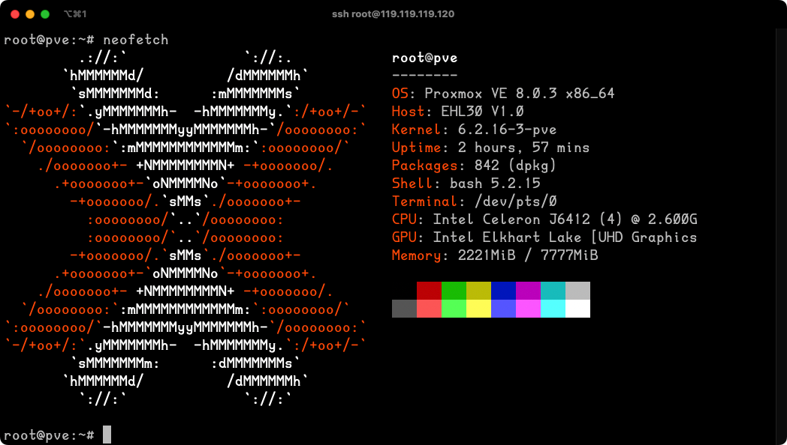

重点感谢以下开源项目! 减少了成吨的工作

- [tpclash](https://github.com/mritd/tpclash) TPClash 可以自动安装 Clash Premium/Meta, 并自动配置基于 Tun 的透明代理.
- [clash-for-linux](https://github.com/wanhebin/clash-for-linux) Linux 端使用 Clash 作为代理工具

## 虚拟机架构

- PVE
  - docker
- iKuai
- LXC Debain clash 透明代理

## 1. PVE 安装

这个有很多现成的教程, 我贴几个参考吧

- 软路由科普系列 篇二：PVE 安装 iKuai OpenWrt 旁路由 基础设置 保姆级全教程 https://post.smzdm.com/p/awrx4lxm/
- U 盘（优盘）安装 Proxmox VE 图文教程 https://www.moewah.com/archives/2497.html
- PVE 系统，详细安装教程 https://post.smzdm.com/p/akkqdor4/

## 2. PVE 安装之后设置

### 2.1. 安装之后, 更新 apt 和 pve 源

```sh
# 替换清华源, 注意一下 Debain 版本
# apt 源 https://mirrors.tuna.tsinghua.edu.cn/help/debian/
vim /etc/apt/sources.list
# pve 源 https://mirrors.tuna.tsinghua.edu.cn/help/proxmox/
vim /etc/apt/sources.list.d/pve-no-subscription.list
apt update
```

### 2.2. 安装 docker 用处多多, 我直接装宿主机了

```bash
# 官方教程 https://docs.docker.com/engine/install/debian/
# 1. Update the apt package index and install packages to allow apt to use a repository over HTTPS:
apt-get install ca-certificates curl gnupg
# 2. Add Docker’s official GPG key:
sudo install -m 0755 -d /etc/apt/keyrings
curl -fsSL https://download.docker.com/linux/debian/gpg | sudo gpg --dearmor -o /etc/apt/keyrings/docker.gpg
sudo chmod a+r /etc/apt/keyrings/docker.gpg
# 3. Use the following command to set up the repository:
echo "deb [arch="$(dpkg --print-architecture)" signed-by=/etc/apt/keyrings/docker.gpg] https://download.docker.com/linux/debian \
  "$(. /etc/os-release && echo "$VERSION_CODENAME")" stable" | \
  sudo tee /etc/apt/sources.list.d/docker.list > /dev/null

# 4. Update the apt package index:
sudo apt-get update
# 5.To install the latest version, run:
sudo apt-get install docker-ce docker-ce-cli containerd.io docker-buildx-plugin docker-compose-plugin
# 6. Verify that the Docker Engine installation is successful by running the hello-world image:
sudo docker run hello-world

# docker 镜像加速 https://dockerproxy.com/docs
# https://www.ioiox.com/archives/127.html

# 写入配置
echo "{ "registry-mirrors": [ "https://dockerproxy.com" ] }" >> /etc/docker/daemon.json
# 配置完成需重载 daemon 并重启 docker
sudo systemctl daemon-reload
sudo systemctl restart docker

```

## 3. 路由规划

- 宿主机: PVE _119.119.119.120_/24
- 虚拟机: iKuai **119.119.119.119** (作为网关)
- LXC &lt;CT&gt;: Debain 11 _119.119.119.123_/24 (使用 clash 作为透明代理服务器)

## 4. 虚拟机安装

## 4.1 iKuai

[爱快路由系统下载](https://www.ikuai8.com/component/download)

优质的教程也很多, 善用搜索

- 我的记录分享之软路由安装（PVE+ikuai+openwrt+NAS+...） https://post.smzdm.com/p/az6w92m0/

## 4.2 CT 容器安装 Debain 11

Tips: 清华源支持 CT Templates 加速

> 具体方法：将 /usr/share/perl5/PVE/APLInfo.pm 文件中默认的源地址 http://download.proxmox.com 替换为

```
https://mirrors.tuna.tsinghua.edu.cn/proxmox
```

> 可以使用如下命令修改：

```bash
cp /usr/share/perl5/PVE/APLInfo.pm /usr/share/perl5/PVE/APLInfo.pm_back
sed -i 's|http://download.proxmox.com|https://mirrors.tuna.tsinghua.edu.cn/proxmox|g' /usr/share/perl5/PVE/APLInfo.pm
```

> 针对 `/usr/share/perl5/PVE/APLInfo.pm` 文件的修改，重启后生效。

1. 根据图示步骤点击下载对应 CT 模版

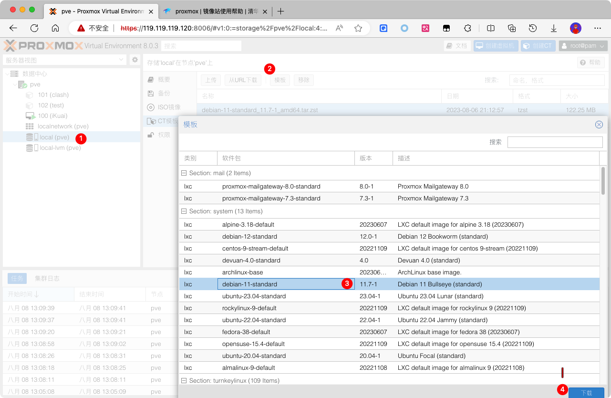
当然也可以使用 `从URL下载` 比如 Debain 11 使用清华源加速的地址是这样
https://mirrors.tuna.tsinghua.edu.cn/proxmox/images/system/debian-11-standard_11.7-1_amd64.tar.zst

2. 创建 LXC Debain
   2.1 一定要**去掉** `无特权容器` 的选择框, 因为下一步要使用的 clash 透明代理需要使用到 `TUN` 隧道转发, 需要提权
   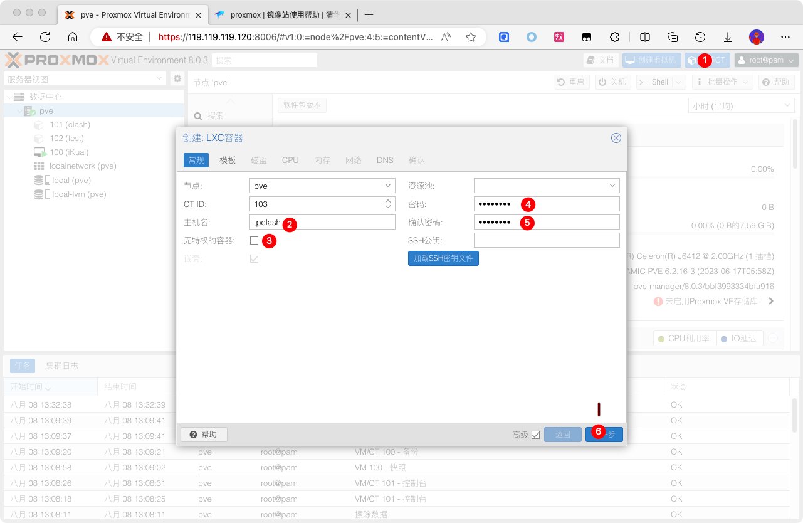
   2.2 选择刚才下载好的模版
   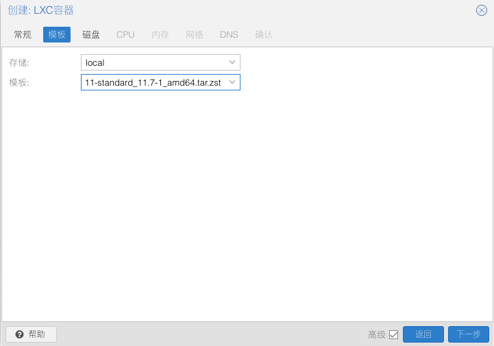
   2.3 磁盘给个 2G 足够了, 注意 PVE 8.0 版本磁盘在 UI 界面只能调大不能减少, 减少需要命令行还有风险, 所以考虑好大小
   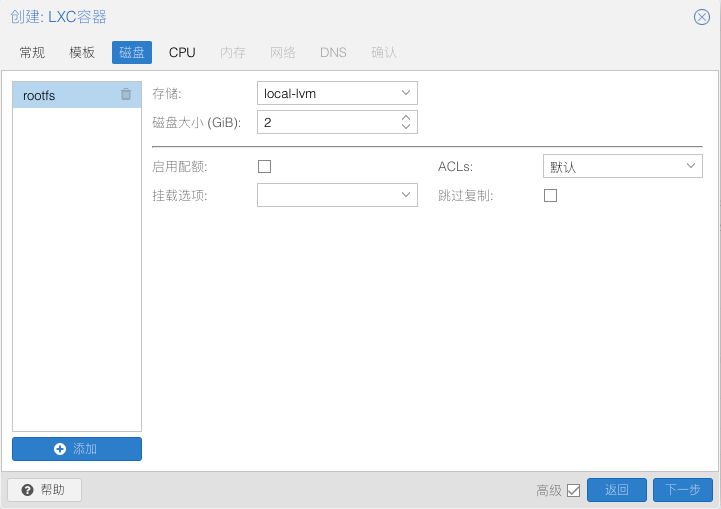
   2.4 CPU 也是看心情
   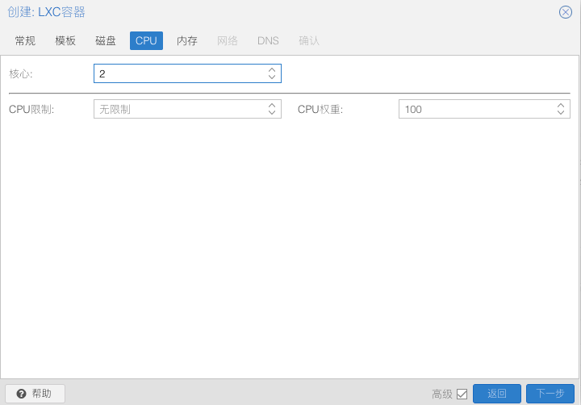
   2.4 内存看心情, 这个后期可以随便调整, 可以先填大一点, 配置操作快一点
   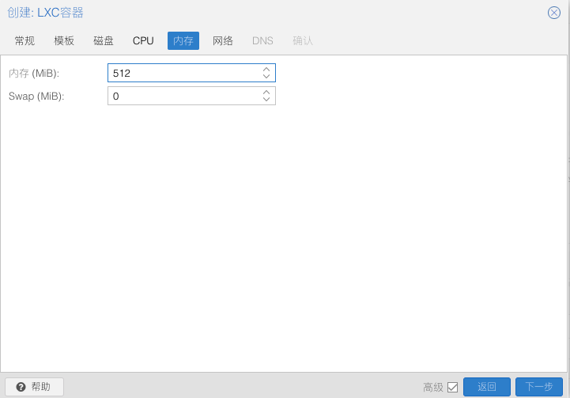
   2.5 防火墙记得去掉, IPv4 填写上面规划的 ip, 网关填写 iKuai ip, IPv6 跳过不理
   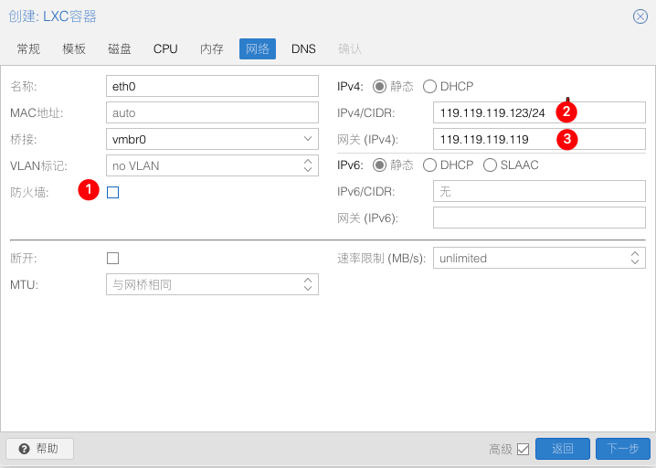
   2.6 DNS 默认值 -> 下一步 -> 完成

4. 配置 Debain 系统
   3.1 登录: 用户名 root, 密码就是刚才创建的时候填写的密码
   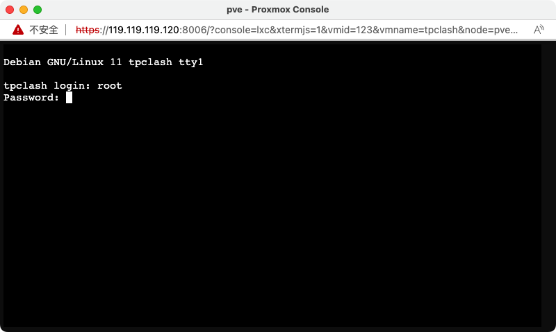
   3.2 第一步依然是更新 apt 源, 注意界面上的 Debain 版本要对应上 https://mirrors.tuna.tsinghua.edu.cn/help/debian/
   3.3 接下来的配置可以使用我这里的脚本 https://github.com/charlzyx/clash-for-linux.git 可以参考原始仓库操作, 也可以按照我的修改脚本来执行; 主要集成了

   > 0. 你应该需要安装一下 git 和 curl `apt install git curl`
   > 1. [clash-for-linux](https://github.com/wanhebin/clash-for-linux) 下载机场订阅文件, 并转换成 clash 对应格式
   > 2. [tpclash](https://github.com/mritd/tpclash) 一键创建 clash 透明代理

   3.4 创建工作目录 /etc/clash, 准备配置文件 /etc/clash.yaml (手动 or 自动)

   ```bash
   mkdir /etc/clash && cd /etc/clash
   git clone https://github.com/charlzyx/clash-for-linux.git
   # 修改 /etc/clash/clash-for-linux/.env 文件里面注释部分
   # export CLASH_URL='更改为你的clash订阅地址'
   # 之后运行 /etc/clash/clash-for-linux/dl.sh, 会将订阅文件下载到 /etc/clash.yaml 提供给 tpclash 使用
   # 当然你也可以手动创建 /etc/clash.yaml 文件, 从而跳过自动下载
   ```

   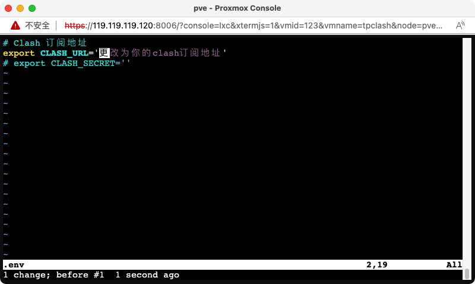
   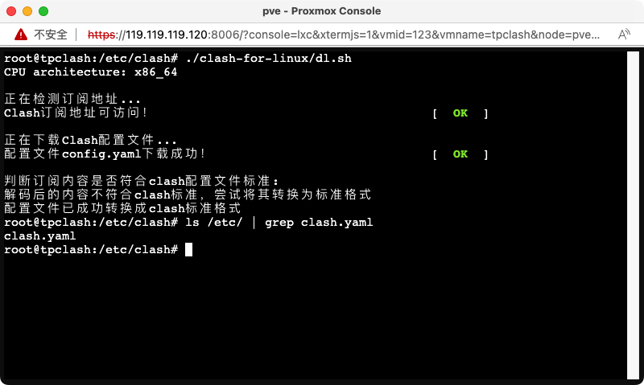

   3.5 安装 tpclash 可以直接参考 https://github.com/mritd/tpclash 官方文档, 我的操作步骤如下

   ```bash
   # 下载二进制文件, 注意平台要对应
   wget https://github.com/mritd/tpclash/releases/download/v0.1.11/tpclash-premium-linux-amd64
   # 重命名, 非必须
   mv tpclash-premium-linux-amd64 tpclash
   # 添加可执行权限
   chmod ./tpclash
   # 执行安装
   ./tpclash install
   ```

   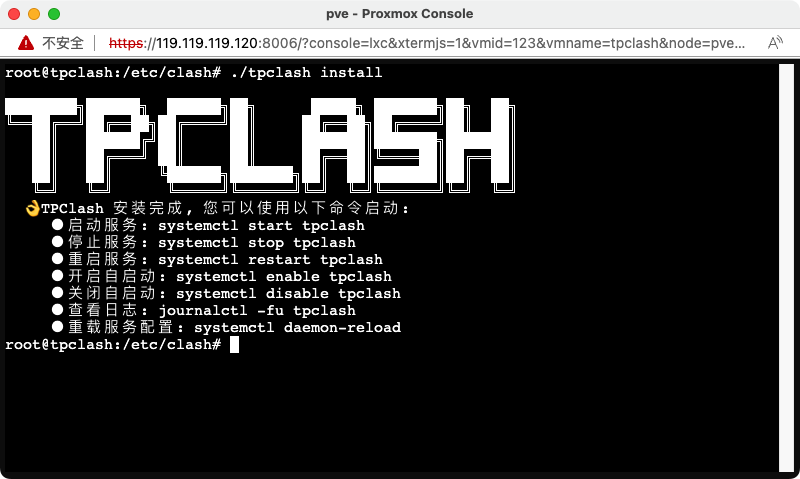

   3.6 根据 [这里](https://github.com/mritd/tpclash/wiki/Clash-DNS-%E7%A7%91%E6%99%AE#%E5%9B%9B%E6%80%BB%E7%BB%93%E4%B8%80%E4%B8%8B) 的提示; 修改 /etc/systemd/resolve.conf, 添加下面 4 行进去

   ```bash
   # 开启ipv4 和 ipv6 转发
   echo "net.ipv4.ip_forward = 1" >> /etc/sysctl.conf && sysctl -p
   echo "net.ipv6.conf.all.forwarding = 1" >> /etc/sysctl.conf && sysctl -p
   ```
   别忘了开启转发
   ```bash
    # /etc/systemd/resolve.conf
    DNS=223.5.5.5
    DNS=119.29.29.29
    Domains=~.
    DNSStubListener=no
   ```

   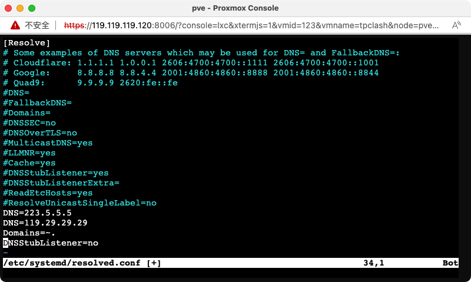
   之后 `systemctl restart systemd-resolved`, 如果有看到 `systemd-resolved.service: Main process exited, code=exited, status=226/NAMESPACE
systemd-resolved.service: Failed with result 'exit-code'.` 类似这样的报错, 请检查容器的 **嵌套** 功能是否开启
   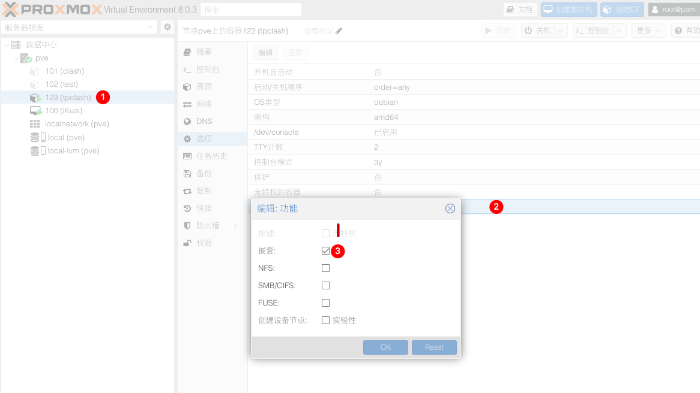

   3.7 第一次启动直接使用 `tpclash` 手动启动, 并修改 /etc/clash.yaml 配置文件中的日志级别设置为 debug 来观察是否有报错
   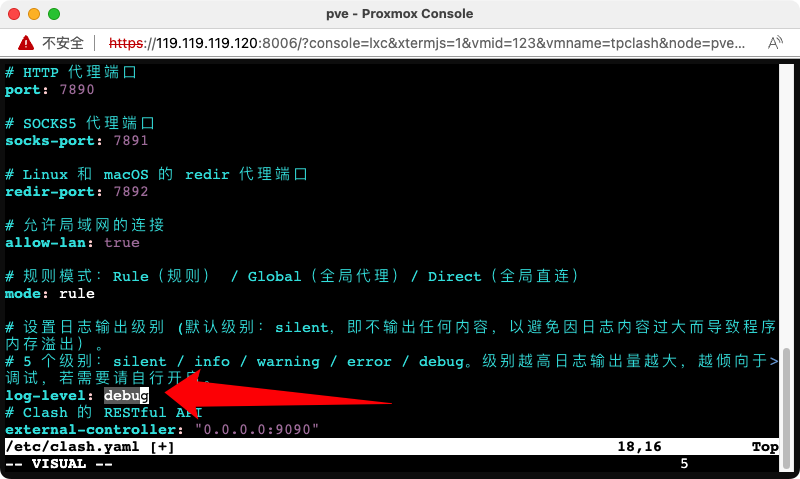

   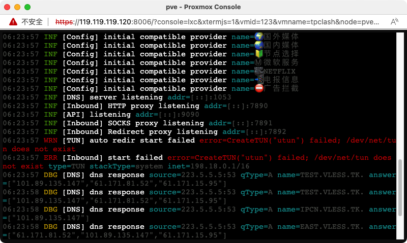
   比方说这样就 `TUN` 隧道 开启失败, 针对这个具体的问题, 我们需要
   打开宿主机 PVE 的控制台, 手动给 lxc 开启 tun, 修改之后重新当前容器

   ```
   cd /etc/pve/lxc && ls
   vim xxx.conf # xxx 为容器 id
   在末尾添加如下配置
   lxc.cgroup.devices.allow: c 10:200 rwm
   lxc.cgroup2.devices.allow: c 10:200 rwm
   lxc.mount.entry: /dev/net dev/net none bind,create=dir
   ```

   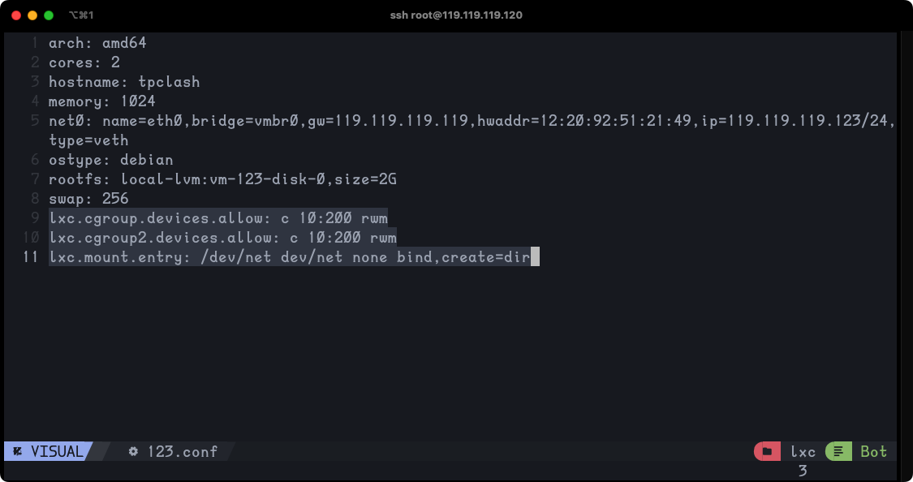
   检查刚才报错的 /ev/net/tun 是否存在
   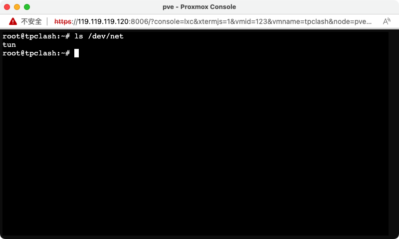

   3.8 排除所有错误之后, 就可以安装 TPClash 成功提示操作 1. 开启自启动 2. 启动服务

   ```sh
     👌 TPClash 安装完成, 您可以使用以下命令启动:
     - 启动服务: systemctl start tpclash
     - 停止服务: systemctl stop tpclash
     - 重启服务: systemctl restart tpclash
     - 开启自启动: systemctl enable tpclash
     - 关闭自启动: systemctl disable tpclash
     - 查看日志: journalctl -fu tpclash
     - 重载服务配置: systemctl daemon-reload
   ```

   验证一下 `curl www.google.com`

   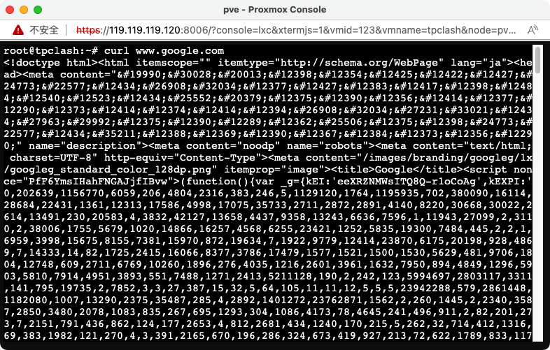

   3.9 验证, 参考 TPClash 官网

   > TPClash 启动成功后, 将其他主机的网关指向当前 TPClash 服务器 IP 即可实现透明代理; 对于被代理主机请使用公网 DNS.
   > 请不要将其他主机的 DNS 也设置为 TPClash 服务器 IP, 因为这可能导致一些不可预测的问题, 具体请参考 [Clash DNS 科普](https://github.com/mritd/tpclash/wiki/Clash-DNS-%E7%A7%91%E6%99%AE).

   我们可以创建一个新的 CT 容器来验证是否可用
   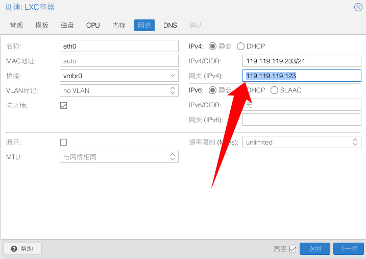
   其他所有选项都可以用默认值, 只有在 ip 这里, 把网关配置为刚才透明代理 ip, 之后进入当前测试容器控制台 `curl www.google.com` 即可验证

   3.10 恭喜 🎉! 至此, 透明 clash 代理 CT 容器配置完毕!
